## Note

---

#### MATLAB基本操作:

```matlab
>> load('test.txt')  % 导入到test变量.
>> who

您的变量为:

test  

>> test

test =

    0.8147    0.9575
    0.9058    0.9649
    0.1270    0.1576
    0.9134    0.9706
    0.6324    0.9572
    0.0975    0.4854
    0.2785    0.8003
    0.5469    0.1419
    
>> save test.txt test -ascii % 保存到文件.
>> pwd

ans =

    'C:\Windows\System32'
% cd ls 都可以用.
>> who % 查看当前变量
>> whos % 查看当前变量和详细信息.

% 矩阵相关:
>> A = [1 2; 3 4; 5 6]

A =

     1     2
     3     4
     5     6

>> A([1 3], :)

ans =

     1     2
     5     6
% 取矩阵的下标是从1开始的

% 拼接: ","或者" "表示横向拼接, ";"表示纵向拼接.
>>  A = [A, [7; 8; 9]]

A =

     1     2     7
     3     4     8
     5     6     9

% 全部列为一列.
>> A(:)

ans =

     1
     3
     5
     2
     4
     6
     7
     8
     9
     
% 注意 "." 加上运算符号的作用.
>> A = [1, 2; 3, 4;]

A =

     1     2
     3     4

>> A.^2

ans =

     1     4
     9    16
     
     
% find函数.
>> find(A < 10)

ans =

     1
     2
     3

>> A

A =

     1     4
     9    16

>> A < 10

ans =

  2×2 logical 数组

   1   1
   1   0

>> 


>> A = magic(3)

A =

     8     1     6
     3     5     7
     4     9     2

% find函数比较靠谱的用法.
>> [r, c] = find(A >= 5)

r =

     1
     2
     3
     1
     2


c =

     1
     2
     2
     3
     3

>> 

%%% max函数:
A =

     8     1
     3     5
     4     9

>> B = [2, 9; 4, 1; 5, 8]

B =

     2     9
     4     1
     5     8

>> max(A, B)

ans =

     8     9
     4     5
     5     9
     
>> A

A =

     8     1
     3     5
     4     9

%%% 取行和列的max
>> max(A, [], 1)

ans =

     8     9

>> max(A, [], 2)

ans =

     8
     5
     9

%%% 同理取行和列的sum
>> sum(A, 1)

ans =

    15    15

>> sum(A, 2)

ans =

     9
     8
    13

>> help flipud
flipud - 将数组从上向下翻转

    此 MATLAB 函数 返回 A，围绕水平轴按上下方向翻转其各行。
>> A

A =

     8     1
     3     5
     4     9

>> flipud(A)

ans =

     4     9
     3     5
     8     1
     

%%% 求逆:
>> pinv(A)

ans =

    0.1472   -0.1444    0.0639
   -0.0611    0.0222    0.1056
   -0.0194    0.1889   -0.1028

>> A * pinv(A)

ans =

    1.0000   -0.0000    0.0000
    0.0000    1.0000   -0.0000
   -0.0000    0.0000    1.0000

>> 

%%% matlab 矩阵索引不可以为 0:
>> A(:, 0:2)
位置 2 的索引无效。数组索引必须为正整数或逻辑值。

```


#### Gradient Descent:

求偏导:
$$
\theta_{j}:=\theta_{j}-\alpha \frac{\partial}{\partial \theta_{j}} J\left(\theta_{0}, \ldots, \theta_{n}\right)
$$
注意结合PDF看这个求导的过程:
$$
J(\theta)=\frac{1}{2 m} \sum_{i=1}^{m}\left(h_{\theta}\left(x^{(i)}\right)-y^{(i)}\right)^{2}
$$
对于多个特征时候就是这样(这个式子也是ex1中实现gradientDescent.m的关键): $\theta_{j}:=\theta_{j}-\alpha \frac{1}{m} \sum_{i=1}^{m}\left(h_{\theta}\left(x^{(i)}\right)-y^{(i)}\right) x_{j}^{(i)}$
(simultaneously update $\theta_{j}$ for $j=0, \ldots, n)$


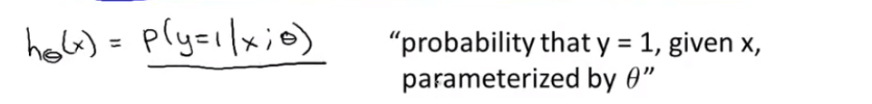
$$
P(y=0 | x ; \theta)+P(y=1 | x ; \theta)=1
$$

#### Decision Boundary:

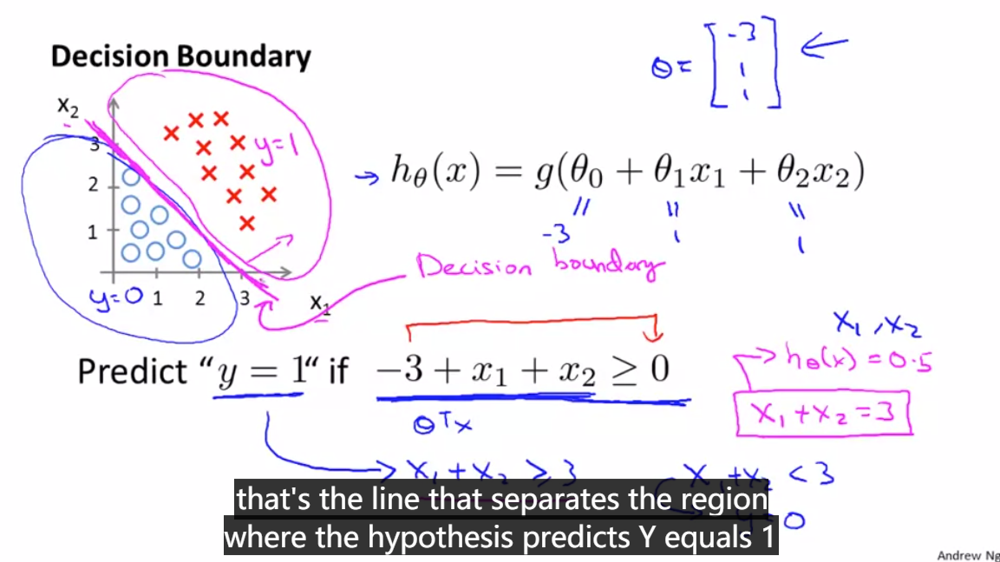

这也是为什么特征矩阵要加一个全是1的那一项, 这样$h_{\theta} = 0$可以是更多的boundary(平面上的就是$x_1, x_2$平面的任意直线), 等于0就是Decision Boundary, 上面的PPT是两个特征的时候可以在几何上表示出来.

上面两个$x_1, x_2$是直线为Decision Boundary的例子, 当然如果非线性分类也可以做:

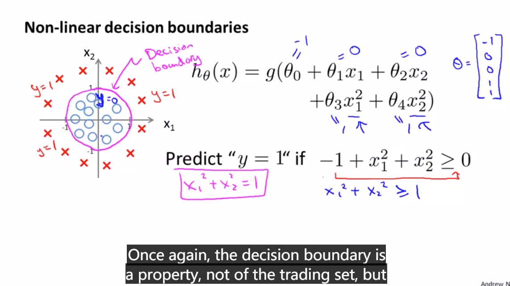


#### Logistic Regression:

hypothesis function:
$$
h_{\theta}(x)=\frac{1}{1+e^{-\theta^{T} x}}
$$
线性回归的套上sigmoid function.

直接用线性回归的**the square** cost function: $J(\theta)=\frac{1}{2 m} \sum_{i=1}^{m}\left(h_{\theta}\left(x^{(i)}\right)-y^{(i)}\right)^{2}$, 因为sigmoid的是很复杂很非线性的, 会导致这样的cost function是**non-convex**. 这样梯度下降法就找不到全局最优.
$$
J(\theta)=\frac{1}{m} \sum_{i=1}^{m} \operatorname{cost}\left(h_{\theta}\left(x^{(i)}\right), y^{(i)}\right)
$$
其中cost部分变为:
$$
\operatorname{cost}\left(h_{\theta}(x), y\right)=\left\{\begin{aligned}
-\log \left(h_{\theta}(x)\right) & \text { if } y=1 \\
-\log \left(1-h_{\theta}(x)\right) & \text { if } y=0
\end{aligned}\right.
$$
体会一下 $h_{\theta}$是0~1的, 如果真实的是1, 但$h_{\theta}$接近于0, 就给可以到无穷大的惩罚.

**可以证明在这样的cost部分下的$J(\theta)$是凸的. // TODO**


整合成下面形式:
$$
\begin{aligned}
J(\theta) &=\frac{1}{m} \sum_{i=1}^{m} \operatorname{cost}\left(h_{\theta}\left(x^{(i)}\right), y^{(i)}\right) \\
&=-\frac{1}{m}\left[\sum_{i=1}^{m} y^{(i)} \log h_{\theta}\left(x^{(i)}\right)+\left(1-y^{(i)}\right) \log \left(1-h_{\theta}\left(x^{(i)}\right)\right)\right]
\end{aligned}
$$
**梯度下降求偏导:**

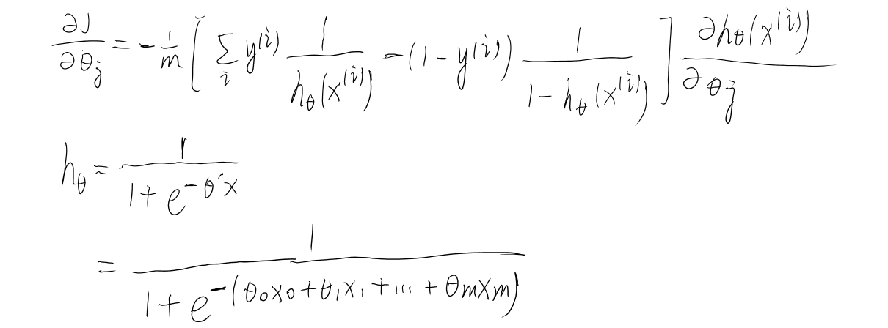

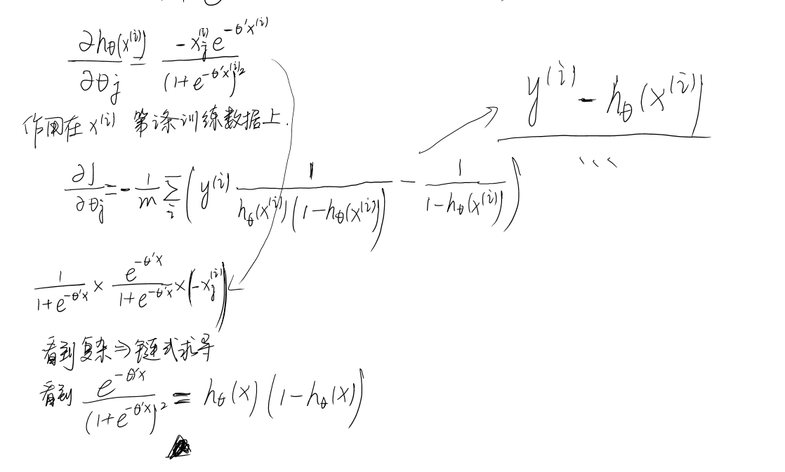

所以最后形式其实和线性回归是一样的:
$$
\theta_{j}:=\theta_{j}-\alpha \sum_{i=1}^{m}\left(h_{\theta}\left(x^{(i)}\right)-y^{(i)}\right) x_{j}^{(i)}
$$
**A vectorized implementation is:**
$$
\theta:=\theta-\frac{\alpha}{m} X^{T}(g(X \theta)-\vec{y})
$$


#### Feature Scaling:

数据范围太大, 用来提高梯度下降的速度, 减少迭代次数.

貌似有一种方法是: **减去平均值再除标准差?**


#### 其他的优化算法以及内置函数调用:

Conjugate gradient

BFGS

L-BFGS

Advantages: no need to manually pick $\alpha$; Often faster than gradient descent.

用内置函数可以, 注意这里**传参优化的$\theta$必须是大于等于2维的, 而且gradient必须都算出来**.

因为MATLAB矩阵下标的原因, gradient(1)是对$\theta_0$求偏导的.

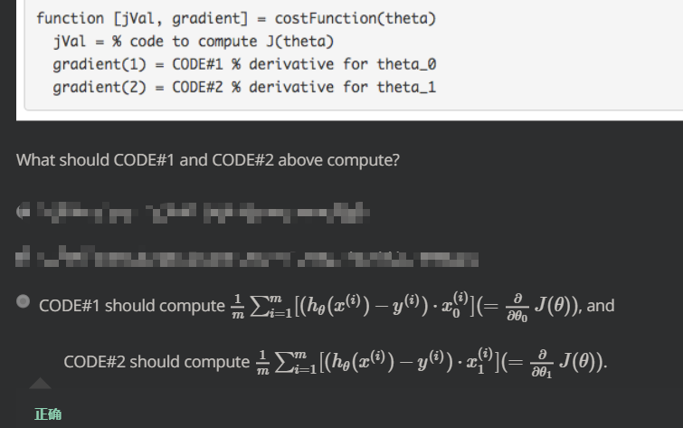

```matlab
options = optimset('GradObj', 'on', 'MaxIter', 100);
initialTheta = zeros(2,1);
   [optTheta, functionVal, exitFlag] = fminunc(@costFunction, initialTheta, options);

function [jVal, gradient] = costFunction(theta)
  jVal = [...code to compute J(theta)...];
  gradient = [...code to compute derivative of J(theta)...];
end
```


#### Logistic Regression on Multiclass Classification:

化为二分类, **三个二分类器**, 计算出分别为各自类的概率, 最后取最大那个.

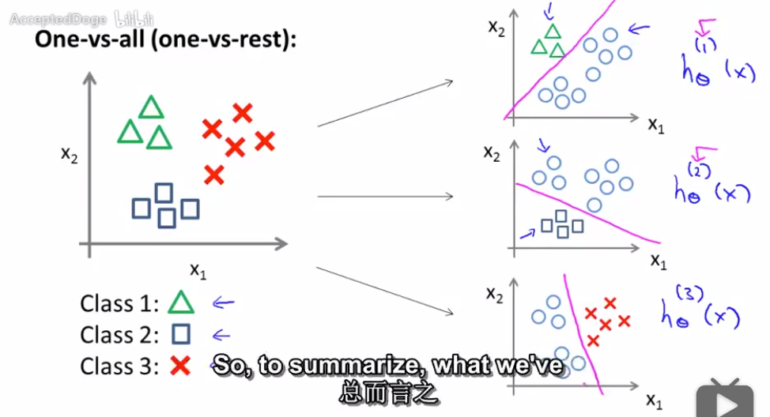


#### Overfitting:

This terminology is applied to both linear and logistic regression. There are two main options to **address the issue of overfitting:**

1) Reduce the number of features:

- Manually select which features to keep. 选择一些feature. 但是丢弃特征的时候也可能会丢弃一些信息.
- Use a model selection algorithm (studied later in the course).

2) **Regularization**

- Keep all the features, but reduce the magnitude of parameters $\theta_j$.
- Regularization works well when we have **a lot of slightly useful features.**


#### Regularization:

"简化"模型. cost function加上关于$\theta_i$的惩罚项. 弱化第$i$个特征的影响.
$$
\min _{\theta} \frac{1}{2 m} \sum_{i=1}^{m}\left(h_{\theta}\left(x^{(i)}\right)-y^{(i)}\right)^{2}+\lambda \sum_{j=1}^{n} \theta_{j}^{2}
$$
The λ, or lambda, is the **regularization parameter**. It determines **how much** the costs of our theta parameters are inflated. (inflate 膨胀). 可以控制是减小参数项更重要还是减小前面的拟合误差更重要.

如果regularization parameter**太大**:

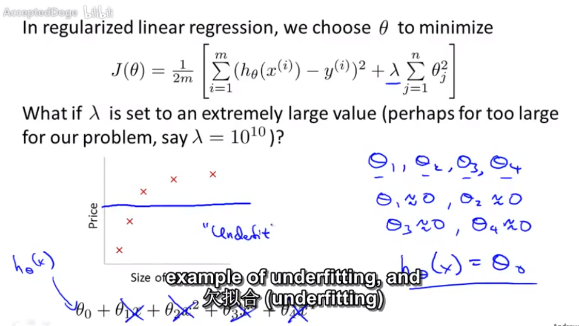


**所以选择regularization parameter很关键**

##### 带有正则项的$\theta$更新方式:

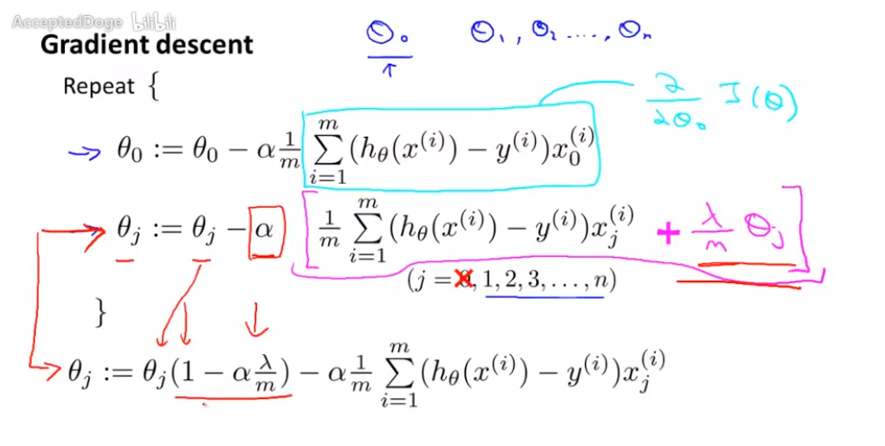

##### normal equation的推导:


$$
\frac{\partial}{\partial \theta_{j}} J(\theta) = 0
$$
推导得到的矩阵表达.
$$
\theta=\left(X^{T} X+\lambda\left[\begin{array}{ccc}
{0} \\
 & {1} \\
{} & {} & {\ddots} \\
{} & {} & {} & {1}
\end{array}\right]\right)^{-1} X^{T} y
$$
同样是用内置函数来求解. 注意除了$\theta_0$以外的会有点不同, 多一个正则项的求导.


#### 注意转化为向量和矩阵表示过程, 注意哪个是行向量哪个是列向量:

---

```matlab
% 实现结果.
grad = zeros(size(theta));

hTheta = sigmoid(X * theta);

J = sum(log(hTheta)' * (-y) - log(1 - hTheta)' * (1 - y)) / m;

for j = 1 : size(grad, 1)
    grad(j, 1) = (hTheta - y)' * X(:, j) / m;
end
```

**其中**
$$
J(\theta)=\frac{1}{m} \sum_{i=1}^{m}\left[-y^{(i)} \log \left(h_{\theta}\left(x^{(i)}\right)\right)-\left(1-y^{(i)}\right) \log \left(1-h_{\theta}\left(x^{(i)}\right)\right)\right]
$$
$J(\theta)$较简单;
$$
\frac{\partial J(\theta)}{\partial \theta_{j}}=\frac{1}{m} \sum_{i=1}^{m}\left(h_{\theta}\left(x^{(i)}\right)-y^{(i)}\right) x_{j}^{(i)}
$$
偏导较难.

**Note:**

1. $h_{\theta}$中的sigmoid是作用在X * theta线性过后的东西.
2. $h_{\theta}\left(x^{(i)}\right)$是一个单值, 1*1矩阵, 因为线性过后了.
3. **求和标号, 就像第二个偏导中的, 往往可以转化成矩阵乘法, 不用写for的**, 这里就转化成`(hTheta - y)' * X(:, j)`, 而且注意**求和符号里面的东西没有一个矩阵减一个数的, 一般都是维度都一样**.

1. $\theta_i$这个下标$i$是从0~n的一共有n+1个, 其中$\theta_0$就是X特征矩阵为1的那个对应的, 在the regularized cost function in logistic regression中不需要被加入正则项, 就是下面是从$j = 1$开始的:
   $$
   +\frac{\lambda}{2 m} \sum_{j=1}^{n} \theta_{j}^{2}
   $$

特征变多时, 交叉项很多, 如果不考虑又不能很好体现特征相关性.


#### Neural Network:

**bias unit** 就是特征矩阵里面加的那一列都是1的.

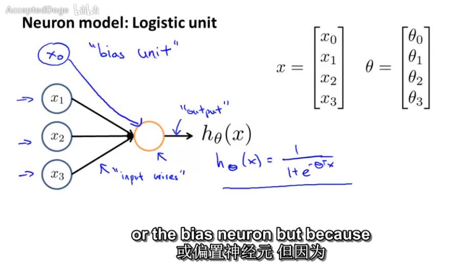

**Note:** 层与层之间有$\theta$, 传到下一层就是加一个$h_{\theta}$(sigmoid)作用在上一层神经元的一维线性组合.
$$
next \quad layer = sigmoid(\theta_0 x_0 + ... + \theta_3 x_3)
$$


**Terminology**: 

1. 第一层是 input layer, 输入特征项 features $x_i ...$ ;
2. 最后一层是 output layer, 输出结果.
3. 中间 hidden layer. 在training set中看不见.


##### forward-propagation -- 多层中间$\Theta$矩阵的维度与表达:

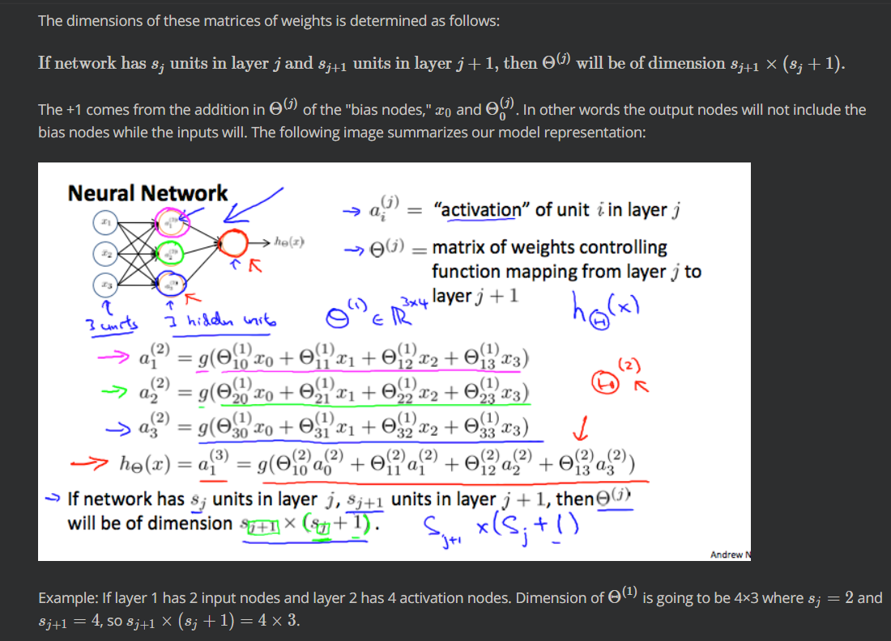

因为有一个**bias item**, 所以前一层维度的**要加1.**


重点掌握: vectorise implementation and complex nonlinear hypothesis


$$
\begin{aligned}
&a_{1}^{(2)}=g\left(\Theta_{10}^{(1)} x_{0}+\Theta_{11}^{(1)} x_{1}+\Theta_{12}^{(1)} x_{2}+\Theta_{13}^{(1)} x_{3}\right)\\
&a_{2}^{(2)}=g\left(\Theta_{20}^{(1)} x_{0}+\Theta_{21}^{(1)} x_{1}+\Theta_{22}^{(1)} x_{2}+\Theta_{23}^{(1)} x_{3}\right)\\
&a_{3}^{(2)}=g\left(\Theta_{30}^{(1)} x_{0}+\Theta_{31}^{(1)} x_{1}+\Theta_{32}^{(1)} x_{2}+\Theta_{33}^{(1)} x_{3}\right)\\
&h_{\Theta}(x)=g\left(\Theta_{10}^{(2)} a_{0}^{(2)}+\Theta_{11}^{(2)} a_{1}^{(2)}+\Theta_{12}^{(2)} a_{2}^{(2)}+\Theta_{13}^{(2)} a_{3}^{(2)}\right)
\end{aligned}
$$
这里其实**向量化就是**
$$
g( \Theta^{(1)} x) \text{矩阵相乘, 这里} \Theta \text{是上面} a_{1}^{(2)}, a_{2}^{(2)}, a_{3}^{(2)} \text{三个} g() \text{里面的总和}
$$


注意上面: **$a^{(2)}$和$z^{(2)}$是三维列向量.** $z^{(2)}$就是上面PPT左边三个g()括号里面的值: $z_{i}^{(2)}$.

**上面是没有加上每层的偏置项的**.

hidden layer 将上一层的激活值作为 logistic function 的输入, 继续这样迭代下去.


##### 神经网络实现OR function XNOR function

---

直观, 就是1, 0之类当做特征输入, 然后OR的结果当做预测结果 $y$ 输出. **赋予特定权重**


用中间hidden layer拼出**异或函数:**

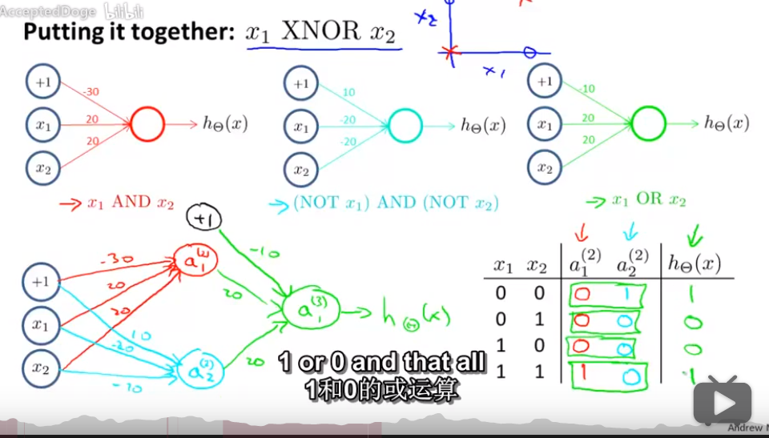

绿色就是后面利用前面的AND和$\lnot x_1 \land \lnot x_2$拼出来的. **可以加bias item**.


##### multiclassification

---

output layer 多个维度(结点), 每个代表是这个分类的概率.

也就是最后:
$$
y^{(i)}=\left[\begin{array}{l}
{1} \\
{0} \\
{0} \\
{0}
\end{array}\right]or\left[\begin{array}{l}
{0} \\
{1} \\
{0} \\
{0}
\end{array}\right]or\left[\begin{array}{l}
{0} \\
{0} \\
{1} \\
{0}
\end{array}\right]or\left[\begin{array}{l}
{0} \\
{0} \\
{0} \\
{1}
\end{array}\right]
$$


#### 好题:

---

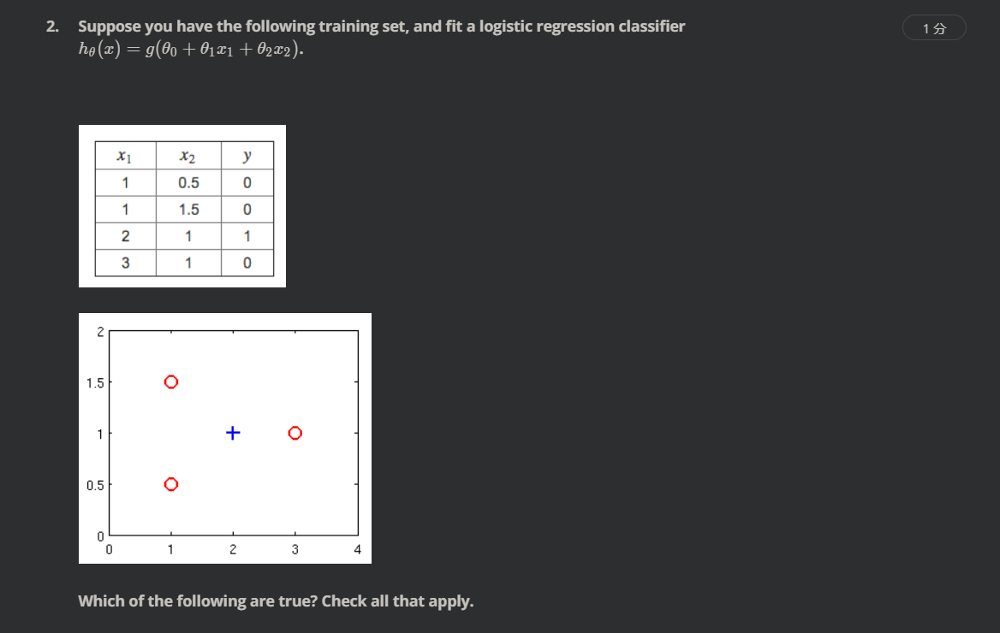


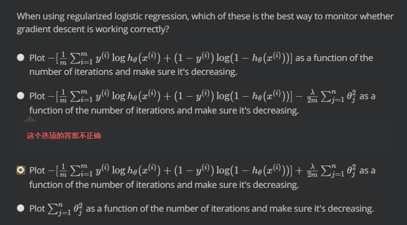


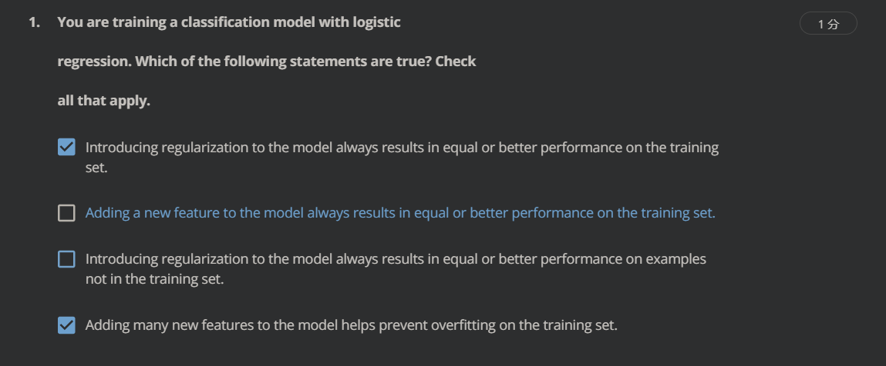


| True or False | Statement                                                    | Explanation                                                  |
| ------------- | ------------------------------------------------------------ | ------------------------------------------------------------ |
| False         | Adding many new features to the model helps prevent overfitting on the training set. | Adding many new features gives us more expressive models which are able to better fit our training set. If too many new features are added, this can lead to overfitting of the training set. |
| False         | Introducing regularization to the model always results in equal or better performance on examples <b> not </b> in the training set. | If we introduce too much regularization, we can underfit the training set and this can lead to worse performance even for examples not in the training set. |
| False         | Introducing regularization to the model always results in equal or better performance on the training set. | If we introduce too much regularization, we can underfit the training set and have worse performance on the training set. |
| True          | Adding a new feature to the model always results in equal or better performance on the training set | Adding many new features gives us more expressive models which are able to better fit our training set. If too many new features are added, this can lead to overfitting of the training set. |

| True or False | Statement                                                    | Explanation                                                  |
| ------------- | ------------------------------------------------------------ | ------------------------------------------------------------ |
| False         | Using a very large value λ cannot hurt the performance of your hypothesis; the only reason we do not set to be too large is to avoid numerical problems. | Using a very large value of λ can lead to underfitting of the training set. |
| False         | Because regularization causes J(θ) to no longer be convex, gradient descent may not always converge to the global minimum (when λ > 0, and when using an appropriate learning rate α). | Regularized logistic regression and regularized linear regression are both convex, and thus gradient descent will still converge to the global minimum. |
| True          | Using too large a value of λ can cause your hypothesis to underfit the data. | A large value of results in a large λ regularization penalty and thus a strong preference for simpler models which can underfit the data. |
| False         | Because logistic regression outputs values 0 <= h<sub>0</sub> <= 1, its range of output values can only be "shrunk" slighly by regularization anyway, so regularization is generally not helpful for it. | None needed                                                  |

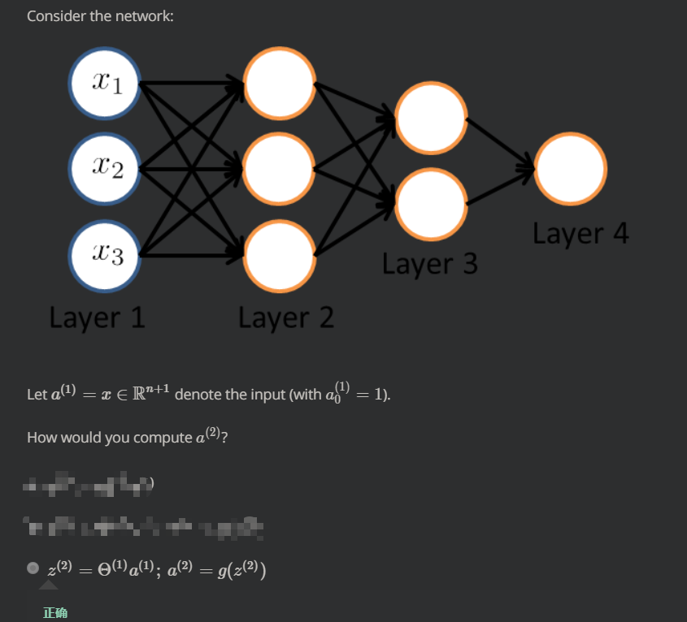

| True or False | Statement                                                    | Explanation                                                  |
| ------------- | ------------------------------------------------------------ | ------------------------------------------------------------ |
| False         | A two layer (one input layer, one output layer; no hidden layer) neural network can represent the XOR function. | We must compose multiple logical operations by using a hidden layer to represent the XOR function. |
| True          | Any logical function over binary-valued (0 or 1) inputs x1 and x2 can be (approximately) represented using some neural network. | **Since we can build the basic AND, OR, and NOT functions with a two layer network, we can (approximately) represent any logical function by composing these basic functions over multiple layers.** |
| False         | Suppose you have a multi-class classification problem with three classes, trained with a 3 layer network. Let a(3)1=(hΘ(x))1 be the activation of the first output unit, and similarly a(3)2=(hΘ(x))2 and a(3)3=(hΘ(x))3. Then for any input x, it must be the case that a(3)1+a(3)2+a(3)3=1. | The outputs of a neural network are not probabilities, so their sum need not be 1. |
| True          | The activation values of the hidden units in a neural network, with the sigmoid activation function applied at every layer, are always in the range (0, 1). | None Needed                                                  |